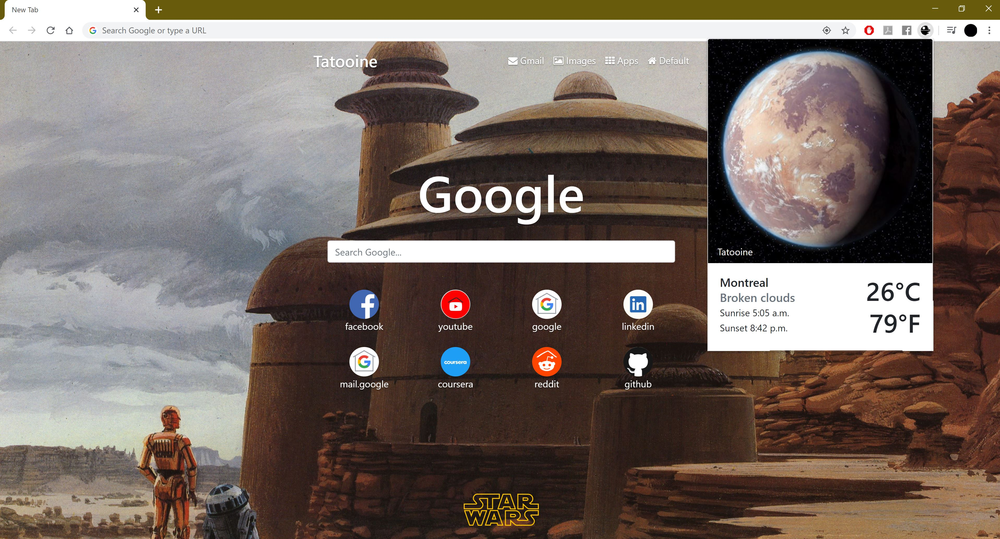

# Star Wars Weather Chrome Extension
Fully responsive new tab chrome extension that displays a beautiful Star Wars planet based on the weather in your current location, and time of day.

This app was trasformed into a NASA astronomy image of the day chrome extension. [Can be seen here](https://github.com/PhilipPhil/NASA-Weather-Chrome-Extension/blob/master/README.md).

Features:
- Background generator based on weather and time of day in your current location.
- Links to your most visited websites.
- Shortcuts for Gmail, Google Images, and the Apps store.
- Link that takes you to the default new tab page.
- Google search bar.
- Fully responsive design. 
- Popup features that displayes current city, temperature, weather, and Star Wars planet image.
- Weather updates of current location with popup.
- Nine different planets, with many backgrounds for each planet and time of day.

Install:
- npm install bootstrap
- npm install jquery
- npm install popper.js
- npm install font-awesome
- npm install bootstrap-social
- npm install psl

Api’s:
- Weather: openweathermap API
- Logos: clearbit Logo API
- TopSites: chrome.topSites Api
- GeoLocation: Geolocation API

## Sample Images

### Night time with mild climate

### Day time with warm climate

### More Examples

